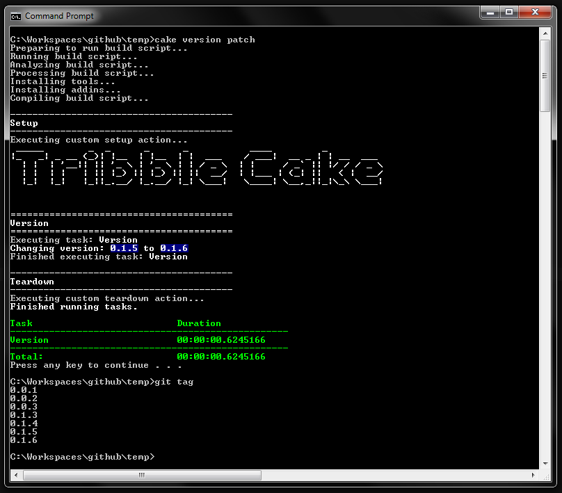

# generator-tribble 
[](https://npmjs.org/package/generator-tribble)
[](https://travis-ci.org/frozenskys/generator-tribble)
[](https://david-dm.org/frozenskys/generator-tribble) 
[](https://coveralls.io/github/frozenskys/generator-tribble?branch=master)
> Scaffolds an application with an enhanced version of cake build.

## Installation
First, install [Yeoman](http://yeoman.io) and generator-tribble using [npm](https://www.npmjs.com/) (we assume you have pre-installed [node.js](https://nodejs.org/)).
```bash
npm install -g yo
npm install -g generator-tribble
```

## <a name="usage"></a>Usage
Then generate your new project:
```bash
mkdir mynewproject
cd mynewproject
yo tribble
```

You can now use the following commands from the command line.
 - `cake` - run the default target (same as ./build.ps1)
 - `cake build` - run the "Build" Task (same as ./build.ps1 -target build)
 - `cake test` - run the "Test" Task (same as ./build.ps1 -target test)
 - `cake package` - run the "Package" task (you get the picture by now...)
 - `cake version major/minor/patch` - run the "Version" task which increments the GitVersion tag major/minor/patch value similar to `npm version patch` e.g.



## What Tribble does
### This generator creates: 

 - Creates empty `src` and `lib` folders
 - Optional cake build files (uses `generator-cake>=0.2.3`)
   - Add common arguments and variables to build.cake
   - Adds some default tasks to build.cake
   - Adds a cake.cmd file (see [usage](#usage))
 - Optional license file (uses `generator-license`)
 - Optional Initialise git repository (uses `generator-git-init`)
   - Creates a base `.gitignore` file
   - Performs an initial commit (uses `generator-git-init`)
   - Create initial git tag (`0.1.0`)


### Still in development:

 - Option to connect local repo to remote repo already created in TFS
 - Option to create remote repo in TFS
 - Create a .vscode folder adding the cake commands as tasks.

## License 
MIT © [Richard Cooper]()
